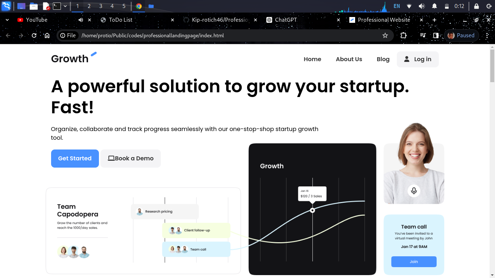
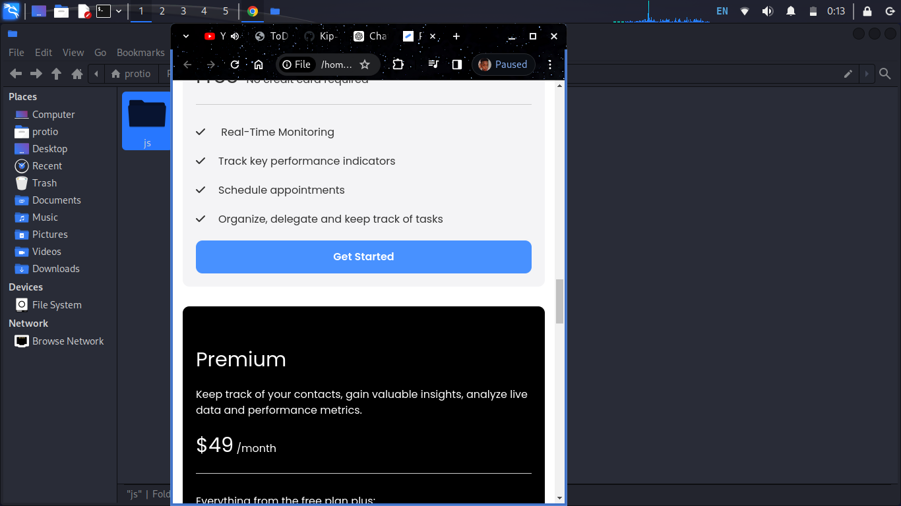

# Professional Landing Page

## Overview
This project is a professional landing page designed using HTML, CSS, and JavaScript. The landing page is fully responsive and optimized for various devices. It includes features such as a navigation bar, hero section, services section, testimonials, and a contact form.

## Table of Contents
- [Demo](#demo)
- [Features](#features)
- [Screenshots](#screenshots)
- [Technologies Used](#technologies-used)
- [Setup](#setup)
- [Usage](#usage)
- [Contributing](#contributing)
- [License](#license)

## Demo
You can view the live demo of the landing page [here](#).

## Features
- Responsive design
- Smooth scrolling
- Interactive elements
- Contact form
- Modern and clean layout

## Screenshots

### Home Page


### Services Section


### Testimonials Section


### Mobile Version


## Technologies Used
- HTML5
- CSS3
- JavaScript (ES6)
- [Bootstrap](https://getbootstrap.com/) (optional)

## Setup
1. Clone the repository:
    ```sh
    git clone https://github.com/your-username/professional-landing-page.git
    ```

2. Navigate to the project directory:
    ```sh
    cd professional-landing-page
    ```

3. Open `index.html` in your browser to view the landing page Or use a live server

## Usage
Feel free to use this landing page template for your own projects. You can customize the content, styles, and scripts according to your needs.

## Contributing
Contributions are welcome! Please follow these steps to contribute:

1. Fork the repository.
2. Create a new branch (`git checkout -b feature/YourFeature`).
3. Commit your changes (`git commit -m 'Add some feature'`).
4. Push to the branch (`git push origin feature/YourFeature`).
5. Open a Pull Request.

